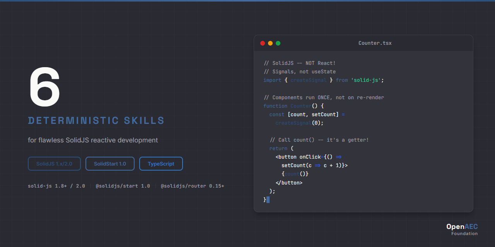

# SolidJS Claude Skill Package

<p align="center">
  
</p>

**Deterministic Claude AI skills for SolidJS reactive framework development.**

Built on the [Agent Skills](https://agentskills.org) open standard.

## Why This Exists

SolidJS looks like React but works fundamentally differently. Claude systematically generates React patterns that **silently fail** in SolidJS:

```tsx
// WRONG - React pattern, breaks SolidJS reactivity
const [count, setCount] = useState(0);

// CORRECT - SolidJS signal
const [count, setCount] = createSignal(0);
```

```tsx
// WRONG - Destructuring props breaks reactivity tracking
function Counter({ count, onClick }) {

// CORRECT - Access props directly to preserve reactivity
function Counter(props) {
  return <button onClick={props.onClick}>{props.count()}</button>
}
```

```tsx
// WRONG - Array.map loses reactivity, no keyed diffing
{items.map(item => <Item item={item} />)}

// CORRECT - <For> component with fine-grained updates
<For each={items()}>{(item) => <Item item={item} />}</For>
```

**AI failure rate without skills: STRUCTURAL** — React contamination is systematic, not occasional.

## Installation

Add to your project's `.claude/settings.json`:

```json
{
  "permissions": {
    "allow": ["skills"]
  },
  "skills": [
    "https://github.com/OpenAEC-Foundation/SolidJS-Claude-Skill-Package"
  ]
}
```

Or clone locally:

```bash
git clone https://github.com/OpenAEC-Foundation/SolidJS-Claude-Skill-Package.git
```

## Package Contents

| Category | Directory | Purpose | Skills |
|----------|-----------|---------|--------|
| Syntax | `solid-syntax/` | Signals, stores, reactivity primitives, JSX compilation | 5 |
| Implementation | `solid-impl/` | Component patterns, routing, SolidStart workflows | 4 |
| Errors | `solid-errors/` | React contamination detection, reactivity debugging | 3 |
| Core | `solid-core/` | Architecture, fine-grained reactivity model, version matrix | 2 |
| Agents | `solid-agents/` | Validation, React-pattern detection, scaffolding | 2 |
| **Total** | | | **16** |

### All Skills

| Skill | Description |
|-------|-------------|
| [solid-syntax-signals](skills/source/solid-syntax/solid-syntax-signals/SKILL.md) | Creating, reading, and updating signals — the core reactive primitive |
| [solid-syntax-stores](skills/source/solid-syntax/solid-syntax-stores/SKILL.md) | Nested reactive state with createStore, produce, and reconcile |
| [solid-syntax-jsx](skills/source/solid-syntax/solid-syntax-jsx/SKILL.md) | JSX compilation model — how SolidJS compiles templates, not VDOM |
| [solid-syntax-components](skills/source/solid-syntax/solid-syntax-components/SKILL.md) | Component authoring — props handling, children, splitting props |
| [solid-syntax-context](skills/source/solid-syntax/solid-syntax-context/SKILL.md) | Context API for dependency injection without prop drilling |
| [solid-impl-solidstart](skills/source/solid-impl/solid-impl-solidstart/SKILL.md) | SolidStart meta-framework — SSR, file routing, API routes |
| [solid-impl-routing](skills/source/solid-impl/solid-impl-routing/SKILL.md) | Client-side routing with @solidjs/router |
| [solid-impl-state-patterns](skills/source/solid-impl/solid-impl-state-patterns/SKILL.md) | State management patterns — global stores, resource caching |
| [solid-impl-testing](skills/source/solid-impl/solid-impl-testing/SKILL.md) | Testing SolidJS components with Vitest and solid-testing-library |
| [solid-errors-react-contamination](skills/source/solid-errors/solid-errors-react-contamination/SKILL.md) | Detecting and fixing React patterns that silently break SolidJS |
| [solid-errors-reactivity-debugging](skills/source/solid-errors/solid-errors-reactivity-debugging/SKILL.md) | Debugging lost reactivity, stale closures, and tracking issues |
| [solid-errors-error-handling](skills/source/solid-errors/solid-errors-error-handling/SKILL.md) | Error boundaries, ErrorBoundary component, fallback patterns |
| [solid-core-reactivity-model](skills/source/solid-core/solid-core-reactivity-model/SKILL.md) | Fine-grained reactivity model — how tracking and subscriptions work |
| [solid-core-overview](skills/source/solid-core/solid-core-overview/SKILL.md) | SolidJS API surface overview and version matrix |
| [solid-agents-review](skills/source/solid-agents/solid-agents-review/SKILL.md) | Code review agent — detects React anti-patterns in SolidJS code |
| [solid-agents-project-scaffolder](skills/source/solid-agents/solid-agents-project-scaffolder/SKILL.md) | Project scaffolding agent — generates SolidJS project structure |

## Technology Coverage

| Technology | Versions | Languages |
|-----------|----------|-----------|
| SolidJS | 1.x, 2.x | TypeScript, TSX |
| SolidStart | 0.x, 1.x | TypeScript, TSX |

## Current Progress

**v1.0.0** — 16 skills across 5 categories, production-ready.

See [ROADMAP.md](ROADMAP.md) for detailed progress.

## Documentation

| File | Purpose |
|------|---------|
| [CLAUDE.md](CLAUDE.md) | Protocols and session instructions |
| [ROADMAP.md](ROADMAP.md) | Project status and next steps |
| [REQUIREMENTS.md](REQUIREMENTS.md) | Quality guarantees |
| [DECISIONS.md](DECISIONS.md) | Architectural decisions |
| [SOURCES.md](SOURCES.md) | Official reference URLs |
| [WAY_OF_WORK.md](WAY_OF_WORK.md) | 7-phase methodology |
| [LESSONS.md](LESSONS.md) | Lessons learned |
| [CHANGELOG.md](CHANGELOG.md) | Version history |
| [INDEX.md](INDEX.md) | Complete skill catalog |

## Used In

- [Open PDF Studio](https://github.com/OpenAEC-Foundation/open-pdf-studio) — Tauri 2 desktop PDF editor

## Related Skill Packages

- [Tauri 2](https://github.com/OpenAEC-Foundation/Tauri-2-Claude-Skill-Package) — Desktop/mobile application framework
- [ERPNext](https://github.com/OpenAEC-Foundation/ERPNext_Anthropic_Claude_Development_Skill_Package) — ERP system
- [Blender-Bonsai](https://github.com/OpenAEC-Foundation/Blender-Bonsai-ifcOpenshell-Sverchok-Claude-Skill-Package) — 3D/BIM modeling

## License

MIT — see [LICENSE](LICENSE)

---

Part of the [OpenAEC Foundation](https://github.com/OpenAEC-Foundation) ecosystem.
